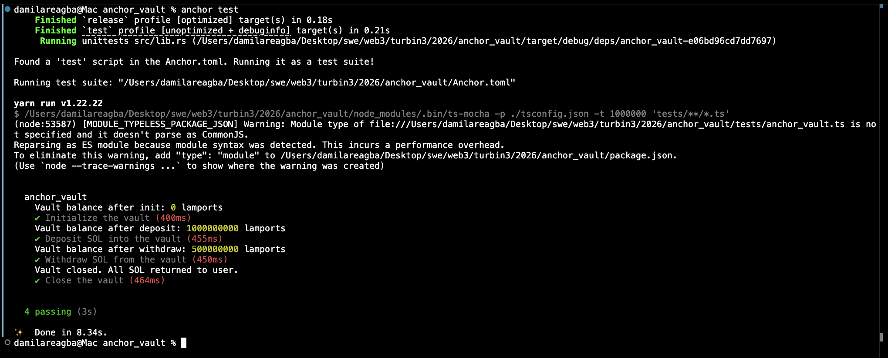

# Anchor Vault Program

A Solana smart contract built with the Anchor framework that implements a SOL vault with PDA-based ownership.

## Instructions

| Instruction | Description |
|-------------|-------------|
| `initialize` | Creates a vault PDA and a state account to store bump seeds |
| `deposit` | Transfers SOL from the user into the vault |
| `withdraw` | Withdraws a specified amount of SOL from the vault back to the user (PDA-signed) |
| `close` | Transfers all remaining SOL back to the user and closes the vault state account |

## How It Works

- A **VaultState** PDA (seeded with `"state"` + user pubkey) stores the bump seeds for both the state and vault accounts.
- A **Vault** PDA (seeded with `"vault"` + vault_state pubkey) holds the deposited SOL.
- Withdrawals and closing use `CpiContext::new_with_signer` so the vault PDA can sign the transfer.
- Closing the vault uses Anchor's `close = user` constraint to reclaim the state account rent.

## Build

```bash
anchor build
```

## Test

```bash
anchor test
```

## Tests Passing


